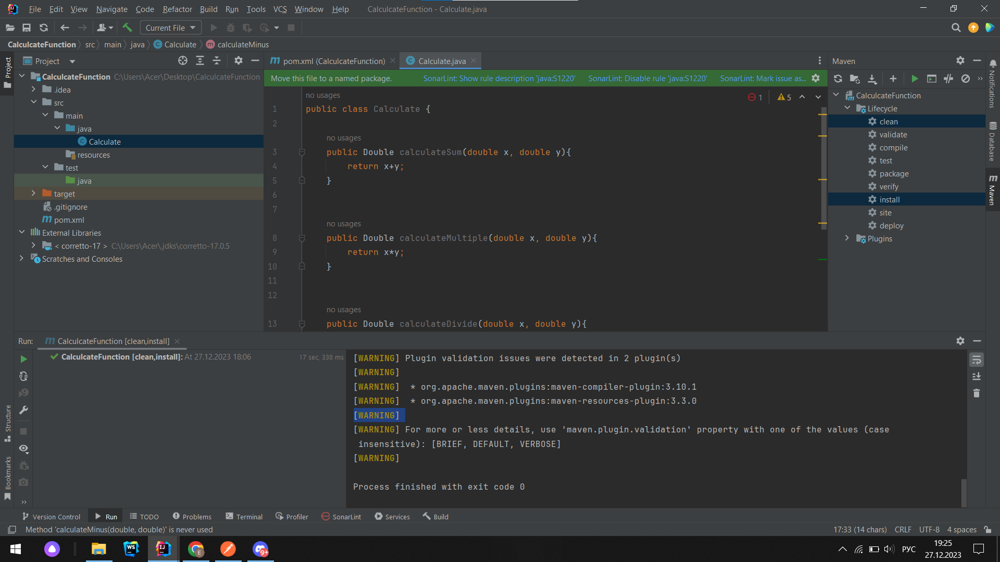
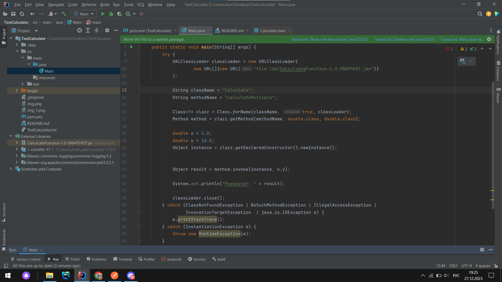
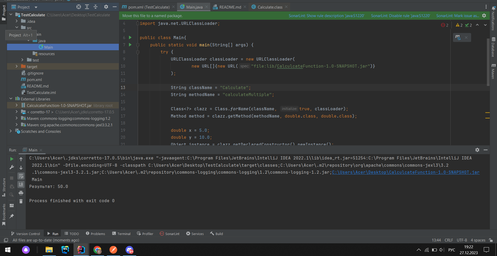

# Проект: Test Calculate

## Обзор

Этот задача содержит два проекта на Java: "CalculateFunction" и "TestCalculate". В проекте "CalculateFunction" определен класс с четырьмя функциями: `calculateSum`, `calculateMultiple`, `calculateDivide` и `calculateMinus`. Эти функции выполняют базовые математические операции.

 JAR-файл, созданный из проекта "CalculateFunction", интегрируется в качестве библиотеки в проект "TestCalculate", что позволяет вызывать функции из класса "Calculate"  с использованием рефлексии.

## Скриншоты
### Первый проект CalculateFunction

### Второй проект TestCalculate

### Результат задачи 

